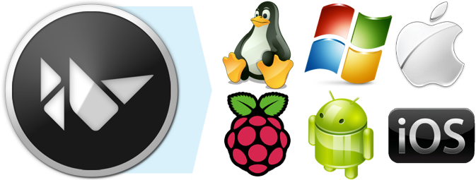

# Kivy App Development
Kivy is a python library that allows you to develop applications for cross platform use. Instead of
having to learn multiple languages and devices, you can make your app in python and then deploy it
on any device including Android, iOS, Windows, Linux, etc.

## Learning
In order to get more familiar with this library, I am following the official [documentation](https://kivy.org/doc/stable/guide/basic.html#quickstart) stack!
- [`basic.py`](./basic.py) is a simple app that opens a black window and shows text.
- [`login.py`](./login.py) is an app with a grid for username and password, no actual functionality though.

## Notes
- For VS Code, there's an extenstion called `Kivy` that will help with syntax highlighting and fill